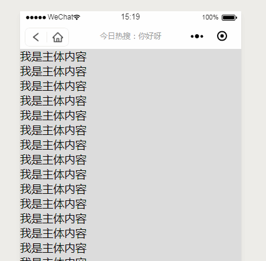

## 小程序自定义导航栏 ##

> **GitHub**: [https://github.com/WozHuang/Miniprogram-Demo/tree/master/custom-navigation](https://github.com/WozHuang/Miniprogram-Demo/tree/master/custom-navigation)

作为前端不一定要什么效果都会做，但是别人能做出来的你也一定要做出来（捂脸.jpg）

做这个的原因是看到了微博的小程序顶部的导航栏有点花里胡哨的东西，于是我也要做。

行吧，那我也造一个 （ノಠ益ಠ）ノ┻━┻

### 优点： ###

1. 花里胡哨的导航栏，老板喜欢，产品喜欢，升职加薪，指日可待

2. 多个页面可以有不同的导航栏啦，还可以满足某个页面不需要导航栏的需求

### 缺点： ###

1. 本质上是模拟出来的导航栏，跟小程序原生的导航栏还有一定区别，有些小程序原生提供的api用不了，比如 `setNavigationBarTitle` 之类的

2. 因为使用 z-index 和 fixed 定位，页面中如果某个元素的 z-index很高会覆盖掉导航栏（当然这个在特定需求也可以实现原生没有的功能，像隐藏/覆盖导航栏之类的）

3. 小程序中存在某些原生组件的层级一定是最高的，此时会覆盖在自定义的导航栏上，如camera组件（2019-1-30华为实测：video标签是原生组件但是不会覆盖在fixed定位上，可以使用）

4. 导航栏是否有返回按钮需要由开发人员控制，麻烦了不少（有考虑通过获取小程序页面栈来判断是否有上一级页面，但是这样如果微信的版本库一旦有调整相关内容那就gg了，因此没做）

### 实现原理 ###

1. 在 app.json 中配置 `navigationStyle: custom` 隐藏原有的导航栏，使用自定义的导航栏，见[官方文档](https://developers.weixin.qq.com/miniprogram/dev/framework/config.html#window)

2. 页面中引入所需要的导航栏组件，由导航栏组件进行交互

### 代码实现 ###

导航栏组件的代码分为了两个部分：

1. `<custom-navigation>` 组件，起着获取和计算状态栏高度和定位导航栏的作用

2. `<my-navigation>` 组件，其中调用了 `<custom-navigation>` ，负责导航栏的交互内容

这样组织代码是为了在复用导航栏组件的同时满足多页面的不同导航栏需求

### 总结 ###

1. 总的来说缺点大于优点，如果非必要建议还是不要搞这种花里胡哨的东西，失去了小程序小而美的特点，而且说不定什么时候微信版本库一更新就掉坑里了

2. 使用自定义导航栏一般是为了实现某些特定的需求，因此代码仅仅作为示例使用，具体实现还要看需求
	
### 效果图： ###

> 参考博客:
> 
> [https://www.jianshu.com/p/7393c800ba09](https://www.jianshu.com/p/7393c800ba09)
> 
> [https://www.jianshu.com/p/5753a0e1754f](https://www.jianshu.com/p/5753a0e1754f)