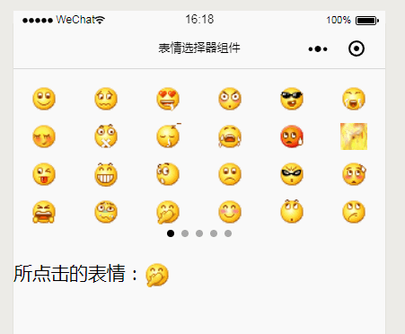

## 小程序表情选择器 ##

> **代码片段**： [https://developers.weixin.qq.com/s/kRgbUMmN724f)
> 
> **GitHub**: [https://github.com/WozHuang/Miniprogram-Demo/tree/master/emoji-picker](https://github.com/WozHuang/Miniprogram-Demo/tree/master/emoji-picker)

之前做了一个表情的[解析组件](https://www.cnblogs.com/wozho/p/10143542.html)，自然就还需要一个用来选择表情的组件~

于是依赖之前的组件做了一个能够左右滑动的选择器

注：其实不依赖之前的组件直接使用utf8中的emoji也可以实现这个功能，只是在不同手机系统下表现不一影响美观

### 优点： ###

1. 类似微信表情的操作，左右滑滑滑，布局好看

### 缺点： ###

1. 同之前的[解析组件](https://www.cnblogs.com/wozho/p/10143542.html)，性能可能不足

2. `<input>` 框里显示的代号有点难看（在小程序里做出来都偷笑了），可以尝试使用一个透明的 `<input>` 输入，下面使用一个 `<view>` 呈现数据，达到显示表情的目的

### 实现原理 ###

1. 依赖[表情解析组件](https://www.cnblogs.com/wozho/p/10143542.html)

1. flex布局排列表情

2. 利用 [`<swiper>`](https://developers.weixin.qq.com/miniprogram/dev/component/swiper.html) 标签可以滑动的特性提供滑动的能力

### 效果图： ###

### 生产中使用的效果（部分信息隐去） ###

